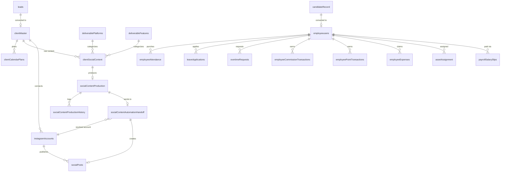
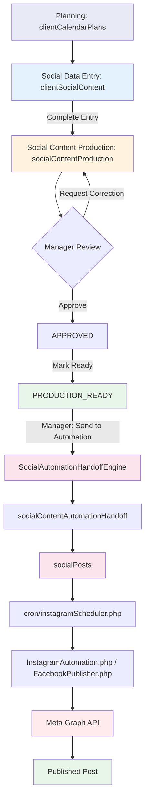

# Modlus System Architecture

## 1. Purpose and Source-of-Truth Hierarchy

This document is the **navigation map** for future development. It exists so that a future phase does not require a full-project rescan — read this document to find *where* something lives, then read the actual implementation file(s) before changing anything.

Three tiers of documentation, in order of authority:

### `CLAUDE.md` — the development contract
Non-negotiable coding rules: no `companyId` in new work, `clientId` as the tenant-isolation boundary, reuse-don't-duplicate architecture, sidebar-integration-in-the-same-change, testing/documentation discipline. When this document and `CLAUDE.md` disagree on a *rule*, `CLAUDE.md` wins.

### `docs/MODLUS_SYSTEM_ARCHITECTURE.md` (this document) — the whole-system map
Where modules live, how they relate, what depends on what, what is ACTIVE vs FOUNDATION vs DEFERRED. This is a map, not an implementation reference — it does not replace reading the actual file before editing it.

### Module-specific documentation — implementation source-of-truth
For the areas that have one, the module doc is authoritative for *implementation detail*:
- `docs/INSTAGRAM_AUTOMATION_PRODUCTION_STATE.md` — Instagram/Facebook automation, production-verified state, real post ids, the Phase 4.7 hardening audit (§28).
- `docs/SOCIAL_CONTENT_PRODUCTION_FOUNDATION.md` — Social Content Production workflow.
- `docs/instagram-automation-readme.md`, `docs/instagram-automation-flow.md`, `docs/instagram-automation-production-checklist.md` — Instagram module onboarding/flow/checklist detail.
- `docs/GMB_INTEGRATION_FOUNDATION_PHASE_14.md` — Google Business Profile foundation.

**When code and documentation conflict, code is authoritative** — this document flags every such discrepancy found during its creation (Phase 5) explicitly rather than silently resolving it either way (§15, §22).

---

## 2. Current System Overview (confirmed facts only)

- **Stack**: Core PHP + MySQL/MariaDB, no framework.
- **Local development**: XAMPP/WAMP (this checkout runs under WAMP64, `c:\wamp64\www\modlus-repo\modlus`).
- **Hosting**: Hostinger (shared hosting, Apache/LiteSpeed behind Hostinger's `hcdn` CDN), production domain `modlus.in`.
- **Routing**: `.htaccess` + a single `routes.php` dispatcher, database-driven via `routesMaster` (§5).
- **Authentication**: two parallel, independently-implemented session-based flows — admin (`$_SESSION['userId']`) and employee/candidate (`$_SESSION['candidateId']`) (§6).
- **Authorization**: `routesMaster` + `rolePermissions` + `userPermissionOverrides` + `permissionActions`, evaluated by `includes/permission-helper.php` (§7).
- **Major application areas**: CRM (leads → clients), HRMS (employee lifecycle, attendance, leave, payroll, overtime, commission/bonus, points, deduction/expense, assets), and Social Media (planning → data entry → production → automation → Meta publishing).
- **No confirmed third-party payment/commerce integrations** — Razorpay, Shopify, Stripe, and PayPal were all searched for; none exist beyond a cosmetic dashboard-template icon and an unrelated npm package's funding link (§19).

---

## 3. High-Level Module Map

| Module | State | Notes |
|---|---|---|
| CRM (Leads → Clients) | **ACTIVE** | `leads` → (conversion) → `clientMaster`; `clientId` is the isolation boundary for everything downstream |
| Employee Master / Directory | **ACTIVE** | `employeeusers` |
| Candidate Management / Onboarding | **ACTIVE** | `candidateRecord` → `employeeProfileVerification` → `employeeusers` |
| Attendance | **ACTIVE** | Punch in/out, breaks, half-day, auto punch-out cron |
| Leave | **ACTIVE** | Apply/approve, balances, accrual/carry-forward crons |
| Payroll | **ACTIVE** | Salary slip generation, approval workflow, real Meta-adjacent hardening this session's earlier phases (unrelated bug fixes, not automation) |
| Overtime | **ACTIVE** | Request/approve, feeds payroll |
| Commission / Bonus | **ACTIVE** | Settings + per-employee transactions, syncs into payroll |
| Employee Points | **ACTIVE** | Category-based point ledger, feeds payroll point deduction |
| Deduction | **ACTIVE** | Modeled under the payroll API domain |
| Expense | **ACTIVE** | Separate table/workflow from Deduction |
| Asset Management | **ACTIVE** | Inventory + assignment/return history |
| Events & Holidays | **ACTIVE** | With notification/celebration crons |
| Permissions module | **ACTIVE** | Role + per-user override management UI |
| Social Data Entry / Planning | **ACTIVE** | Calendar plans → raw content entry |
| Social Content Production | **ACTIVE** | Full lifecycle, `PRODUCTION_READY` terminal-for-this-stage |
| Production → Automation Handoff | **ACTIVE** | Phases 4.1–4.7 complete, real Meta publishes independently verified |
| Social Automation (`socialPosts`/scheduler) | **ACTIVE** | Instagram + Facebook only |
| Instagram | **ACTIVE (production-verified)** | Image publishing confirmed live; carousel/reel implemented, not production-verified |
| Facebook | **ACTIVE (production-verified)** | Image + text post publishing confirmed live |
| LinkedIn | **FOUNDATION, PAUSED** | Code complete; live validation blocked on a real LinkedIn Company Page |
| Pinterest | **FOUNDATION** | Code complete for Trial-Access scopes; Standard Access pending for publishing |
| Google Business Profile | **FOUNDATION** | Current priority per its own doc; live Google API access pending external approval |

---

## 4. Application Architecture

```
Browser
  ↓
.htaccess  (blocks includes/ & vendor/, routes /api/*.php through api-gateway.php,
            strips .php extensions, routes everything else to routes.php)
  ↓
routes.php  (admin pages)  ──or──  api-gateway.php  (API requests)
  ↓                                     ↓
pages/*.php  or  employee/*.php    api/<category>/*.php
  ↓                                     ↓
includes/*Engine.php  (business logic, where a dedicated engine exists)
  ↓
MySQL (mysqli, prepared statements)  /  external services (Meta Graph API, SMTP, etc.)
```

- **`pages/*.php`** — admin/HR-facing screens. Include `includes/auth.php`, `includes/header.php`, `includes/sidebar.php`.
- **`employee/*.php`** — employee self-service screens. Include `includes/emp-auth.php`, `includes/emp-header.php`, `includes/emp-sidebar.php`.
- **`app/controllers/*.php`** — a small, separate MVC-style layer used only for: admin login/signup/OTP/password-reset (`AuthController`), candidate login/profile/password-reset (`CandidateAuthController`, `CandidateProfileController`), and Overtime setup (`OvertimeSetupController`). These are the only "controller-based routes" (§5) — everything else is a flat page file.
- **`includes/*Engine.php`** — business logic, where a dedicated engine exists (Attendance, Leave, Payroll/PayrollApproval, Social Content Production, Social Automation Handoff, Social Post, Instagram/Facebook/LinkedIn/Pinterest/GBP Automation, Commission/Bonus, Employee Points, Calendar, Lead). **Overtime, Expense, Asset, and Deduction modules keep their logic inline in `api/*.php` files instead — no dedicated engine class exists for these four** (confirmed by search; document, don't "fix" by retrofitting an engine).
- **`cron/*.php`** — CLI-only background jobs (§17).
- **`database/migrations/*.sql`** — dated, additive migration files; the actual schema is the authority when they disagree with any doc.
- **`uploads/*`** — per-feature storage directories (§18).

---

## 5. Routing Architecture

**`.htaccess`** (root), in order:
1. Blocks direct access to `includes/` and `vendor/` (403).
2. `RewriteRule ^api/.+\.php$ api-gateway.php` — every API request goes through the gateway first.
3. Real files/directories are served directly (static assets, `uploads/`, etc.).
4. `.php` extensions are 301-redirected away for non-API URLs (clean URLs).
5. `/api/` is explicitly excluded from falling through to `routes.php`.
6. Everything else → `routes.php`.

**`routes.php`**:
1. Normalizes the request path against `BASE_URL`.
2. `/` redirects to `/login`.
3. **`getRouteByPath($path)`** (in `includes/permission-helper.php`) does `SELECT * FROM routesMaster WHERE routePath = ? AND isActive = 1` — routing is entirely database-driven, not a hardcoded switch. No match → literal 404.
4. If the route is not `isPublic`: not logged in → redirect to `/login`, unless the path starts with `/emp-`, `/employee-`, or `/candidate-`, in which case → `/candidate-login`. Logged in but missing `canView` → redirect to `/permission-denied`.
5. A small hardcoded `switch` intercepts exactly five candidate-auth paths and dispatches them to `app/controllers/CandidateAuthController.php` methods instead of a page file — the only controller-based routes.
6. Otherwise: `require_once __DIR__ . $route['pageFile']`.

**`routesMaster` columns**: `id, routePath (unique), pageFile, routeTitle, moduleName, layoutType (enum: admin/employee/public), iconClass, parentRouteId, isPublic, isMenuVisible, isActive, sortOrder`.

**Admin vs. employee routing** is not a structural split (one `routes.php` handles both) — it's differentiated only by (a) the login-redirect path-prefix heuristic above, and (b) `hasRoutePermission()`'s internal logic granting admins unconditional access while checking `rolePermissions`/`userPermissionOverrides` for employees (§7). The common real-world pattern is **two separate files for the two audiences** (e.g. `api/social-content-production/get-tasks.php` vs. `emp-get-tasks.php`), each gated by the matching `auth.php`/`emp-auth.php`, rather than one endpoint branching internally.

### API Gateway (`api-gateway.php`)

Every `/api/*.php` request passes through this file first:
1. Strict path validation + `realpath()` containment check (blocks `..` traversal outside `api/`).
2. Looks up `permissionActions` (joined to `routesMaster`) by `apiEndpoint` + `httpMethod`. **This table currently has 0 rows** — meaning, in practice, every current API endpoint passes through the gateway with no gateway-level permission check and relies entirely on its own internal `auth.php`/`emp-auth.php` + CSRF + permission logic (§15, §16). The mechanism is fully built (schema + enforcement code) but not yet populated for any endpoint.
3. If a `permissionActions` row *did* match, the gateway would require both page-level `canView` and the specific action's permission before including the file.

---

## 6. Authentication Architecture

Two independent, symmetric flows. Neither calls into the other.

### Admin Authentication
1. `app/controllers/AuthController.php::login()` — email/password via `password_verify()`, OTP-gated if the account has a pending OTP.
2. On success: `session_regenerate_id(true)`, `regenerateCsrfToken()`, clears any leftover candidate session keys, then sets `$_SESSION['userId']`, `$_SESSION['authUserType'] = 'admin'` — **and `$_SESSION['companyId'] = $user['id']`** (see the flagged discrepancy in §15).
3. Gate: `includes/auth.php` — `if (empty($_SESSION['userId'])) redirectTo('login');`.

### Employee Authentication
1. `app/controllers/CandidateAuthController.php::login()` — email/password + `accountStatus === 'Active'` check.
2. On success: `session_regenerate_id(true)`, `regenerateCsrfToken()`, clears leftover admin session keys, sets `$_SESSION['candidateId']`, `$_SESSION['candidateName']`, `$_SESSION['candidateEmail']`, `$_SESSION['candidateProfileStatus']`, `$_SESSION['authUserType'] = 'employee'`.
3. Gate: `includes/emp-auth.php` — `if (empty($_SESSION['candidateId'])) redirectTo('candidate-login');`.

**Two independent guard layers exist and are both real** — not a bug, but worth knowing:
- `auth.php`/`emp-auth.php`: simple single-field guards, used by most page files and many API files directly.
- `includes/permission-helper.php`'s `isLoggedIn()`/`getLoggedInUserType()`/`getLoggedInUserId()`: a richer, type-aware layer used by `routes.php`'s permission check and by all role/permission-lookup functions. It prefers `$_SESSION['authUserType']` but falls back to inferring type from whichever id is set.

Neither layer calls the other; they are consistent in practice (both key off `userId`/`candidateId` presence) but implemented independently. `employeeusers.candidateRecordId` is the FK from an employee record back to the `candidateRecord` that was converted into it.

---

## 7. Permission Architecture

Tables: `routesMaster`, `rolePermissions`, `userPermissionOverrides`, `permissionActions`, `userActionPermissionOverrides`, `roleActionPermissions`.

Evaluation order (`includes/permission-helper.php`):

1. **`hasRoutePermission($routePath, $action)`** — `$action` ∈ `canView|canAdd|canEdit|canDelete|canApprove`.
   - Public route → always allowed.
   - Not logged in → denied.
   - **Admin (`userId` present) → always allowed, unconditionally** — there is currently no per-admin-role restriction; the `users` table has no role column, so every admin has full access to every `canX` permission on every route. `canApprove` reuse (e.g. for "Send to Automation") is real, enforced code for employees, but a no-op restriction for admins today.
   - Employee → checked in order: `userPermissionOverrides` (per-user, per-route) → else `rolePermissions` (per-`designationName`, per-route) → else deny.
2. **`hasActionPermission($routePath, $actionKey)`** — for granular "button actions" registered in `permissionActions`. Admin → always allowed. Employee → `userActionPermissionOverrides` → else `roleActionPermissions` → else deny. This is the mechanism the API Gateway (§5) would use if any `permissionActions` rows existed.
3. **`requireRoutePermission()` / `requireActionPermission()`** — the enforcing wrappers; redirect (page context) or return a 403 JSON body (`/api/` context) on failure.
4. **`getCurrentUserPermissions()`** — used to hydrate frontend permission-aware UI (hiding/disabling buttons). **Frontend hiding is never authorization** — every mutating endpoint must independently re-check server-side (confirmed pattern throughout `api/`).
5. **Super Admin** — `isLoggedInUserSuperAdmin()` checks the logged-in admin's email against a hardcoded allow-list (3 emails). Used to gate the highest-privilege screens (e.g. Salary Slip Approval).

Permission types per CLAUDE.md: View / Add / Edit / Delete / Approve / Button Action — all five/six are real, implemented columns/mechanisms, not aspirational.

---

## 8. Sidebar / Navigation Architecture

- **`includes/sidebar.php`** (admin) and **`includes/emp-sidebar.php`** (employee) each build their menu from a **hardcoded PHP array** (`$menuGroups`), grouped by module (e.g. "Social Media", "Employee Panel").
- `routesMaster.isMenuVisible` **and** `hasRoutePermission($route, 'canView')` gate *whether an item already present in that hardcoded array is allowed to render* — they do **not** add new items to the menu by themselves. A `routesMaster` row with no matching sidebar array entry is reachable by direct URL but invisible in navigation (this exact gap was hit and fixed during Social Content Production's own early phases — see `docs/SOCIAL_CONTENT_PRODUCTION_FOUNDATION.md`).

> ### NON-NEGOTIABLE: Whenever a new page, menu item, or submenu is created, it MUST be added to the correct sidebar array (`includes/sidebar.php` and/or `includes/emp-sidebar.php`) in the SAME implementation — a `routesMaster` row alone is not sufficient. This has caused a real, previously-shipped bug and must never be deferred.

---

## 9. Database Architecture

Only verified relationships shown; not every column.



Notes:
- `clientMaster.leadId → leads.id`; `clientMaster.agreementId` is unique; `clientMaster.clientCode` is the human-facing client identifier.
- `employeeusers.candidateRecordId → candidateRecord.id` (nullable — set only at joining-confirmation time).
- `socialContentAutomationHandoff.productionId` is `UNIQUE` — the actual duplicate-handoff guard, not application logic (see `docs/INSTAGRAM_AUTOMATION_PRODUCTION_STATE.md` §28).
- `deliverablePlatforms`/`deliverableFeatures` are pre-existing lookup tables (predate this repo's tracked migrations) — `deliverablePlatforms` currently contains Instagram, Facebook, YouTube, Telegram, LinkedIn, Pinterest, Twitter, GMB, Google Ads, SEO, Videos as rows; only Instagram/Facebook are automation-eligible (§10.4).

---

## 10. Social Media Architecture

### 10.1 Planning / Calendar
- `includes/calendarEngine.php` (`CalendarEngine`), table `clientCalendarPlans` (`clientId, platformId, featureId, selectedDates, removedDates, month`). This is the "which dates, for which platform/feature, this month" plan that Social Data Entry fills in against.

### 10.2 Social Data Entry — RAW MATERIAL
- Page: `pages/social-data-entry.php` (+ `pages/social-overview.php` for the read-only overview).
- Table: `clientSocialContent` (`clientId, platformId, featureId, contentDate, title, status, caption, referenceLink, remarks, ...`), unique on `(clientId, contentDate, platformId, featureId)`.
- API: `api/social-content/{save-entry,get-entries,get-plan,delete-entry,complete-entry}.php`.
- **"Complete Entry"** (`complete-entry.php`) is the one explicit action that sets `status='ready'` **and** creates the corresponding `socialContentProduction` row (via `SocialContentProductionEngine::createTask()`), inside one transaction. Plain `saveEntry()` never creates a production task, regardless of status value chosen in the UI.

### 10.3 Social Content Production — MANUFACTURING
- Page (manager): `pages/social-content-production.php`. Page (editor): `employee/emp-content-production.php`.
- Engine: `includes/SocialContentProductionEngine.php` (`SocialContentProductionEngine`) — owns the entire lifecycle; a single `TRANSITIONS` table enforces valid status moves server-side.
- Tables: `socialContentProduction` (one row per `clientSocialContentId`, `UNIQUE`), `socialContentProductionHistory` (append-only).
- API: `api/social-content-production/{get-tasks,manage-task,get-editors,emp-get-tasks,emp-update-task,emp-submit-production,send-to-automation}.php`.
- Statuses: `NEW → ASSIGNED → IN_PROGRESS → SUBMITTED → CORRECTION|APPROVED → PRODUCTION_READY`. TAT = `contentDate - 1 day, 17:00`, computed once at task creation, never auto-pushed forward if already past.
- Editors: assign own work, submit output (Drive link or uploaded file, JPEG/MP4/MOV, real-`finfo` validated). Cannot approve, cannot mark ready, cannot assign.
- **`PRODUCTION_READY` is a pure business-state marker** — `SocialContentProductionEngine` never writes to `socialPosts` and has zero knowledge of `SocialAutomationHandoffEngine` (one-directional dependency, enforced by design — see §20). **One narrow, intentional exception (Phase 6)**: `SocialContentProductionEngine::recordExternalEvent()` is a public method that lets an external caller (`SocialAutomationHandoffEngine`, on a successful/failed "Send to Automation") append one append-only history row to a task's own timeline, without going through status-transition validation. The dependency direction is unchanged — Production still never calls into or knows about the Handoff engine; this only lets Handoff push one event *in*, the same way any other caller of `logHistory()`-style append-only logging would.
- Manager-page operational monitoring (Phase 6, additive, no redesign): a server-derived status/overdue summary and an editor-workload view (`SocialContentProductionEngine::getProductionSummary()`, `api/social-content-production/get-summary.php`), plus a Platform filter reusing the existing `api/deliverables/get-platforms.php` lookup. Automation status (`sent`/`pending`/`failed`) is now also shown in the task detail modal, reusing fields `get-tasks.php` already attached in Phase 4.5.

### 10.4 Production → Automation Handoff
- Engine: `includes/SocialAutomationHandoffEngine.php` (`SocialAutomationHandoffEngine`) — the **sole** owner of this boundary.
- Table: `socialContentAutomationHandoff` (`productionId UNIQUE, instagramAccountId, socialPostId, status [pending|sent|failed], errorMessage, createdBy`).
- API: `api/social-content-production/send-to-automation.php` — accepts only `productionId` from the browser; every other value is derived server-side.

```
PRODUCTION_READY
    ↓
checkEligibility(): task exists → status==PRODUCTION_READY → platform is instagram/facebook
    (by deliverablePlatforms.platformName, never hardcoded id) → not already handed off
    ↓
resolveActiveAccount(clientId): 0 active accounts → BLOCK
                                 exactly 1 active → AUTO-RESOLVE
                                 2+ active → BLOCK (never guessed/newest/handle-matched)
    "active" = status='connected' AND (tokenExpiry IS NULL OR tokenExpiry > NOW())
    ↓ (instagramAccountBelongsToClient() re-checked, defense in depth)
resolveMedia(): server upload → real finfo MIME check, JPEG only (PNG/MP4/MOV rejected in V1,
                verified against Meta's own JPEG-only requirement for image_url posts)
                Drive submission → MANUAL_PUBLISH_REQUIRED, never downloaded/auto-published
    ↓
registerHandoff(): INSERT ... UNIQUE(productionId) is the real concurrency guard
    ↓
saveSocialPost() [EXISTING, unmodified] called in insert-only mode
    ↓ success                                    ↓ failure
handoff → SENT, socialPostId set          handoff → FAILED, errorMessage stored
```

No DB transaction wraps the `saveSocialPost()` call — it internally calls `ensureSocialPostsTable()`, which can run DDL, and DDL implicitly commits any open MySQL transaction (documented finding from the Architecture Lock phase). Ordered writes + the `UNIQUE` constraint are the actual safety mechanism, not a transaction.

### 10.5 Social Automation
- Engine: `includes/SocialPostEngine.php` — the single unified publishing entry point (`publishSocialPost()`), dispatches per-platform, never duplicates transport logic.
- Table: `socialPosts` (`clientId, instagramAccountId, mediaType, mediaUrl [JSON array of relative paths], caption, status [draft|scheduled|publishing|published|failed|partial], scheduledAt, publishedAt, instagramMediaId, platforms, facebookStatus, facebookPostId, facebookErrorMessage, errorMessage`).
- Scheduler: `cron/instagramScheduler.php` — CLI-only, the **only** scheduler. Three phases per run: (A) finalize in-flight Reels, (A2) recover stuck image/carousel posts, (B) publish newly-due `scheduled` posts. Duplicate-publish protection: a `flock()` single-instance lock plus a `status` transition (`scheduled→publishing` before any Meta call) combined with recovery logic that checks the *persisted* `instagramMediaId`/`facebookPostId` rather than the aggregate status — see full audit in `docs/INSTAGRAM_AUTOMATION_PRODUCTION_STATE.md` §28, including the one documented, unfixed "ambiguous Meta success" edge case requiring manual reconciliation.
- API: `api/social-media/{saveSocialPost,getSocialPosts,deleteSocialPost,publishSocialPostNow}.php`.
- Page: `pages/social-create-post.php` (composer), `pages/social-posts.php` (list/status).

### 10.6 Instagram
- Engine: `includes/InstagramAutomation.php` — accounts, OAuth, media upload/validation, Graph API transport (`instagramGraphApiRequest()`), publishing functions, insights, comments, webhooks.
- Tables: `instagramSettings` (one row, platform-wide Meta app credentials, `metaAppSecret` encrypted), `instagramAccounts` (one row per connected account, `accessToken` encrypted via `includes/Crypto.php`), `instagramInsights`, `instagramComments`, `instagramWebhookEvents`.
- OAuth: Facebook Login for Business, `state` validated via `hash_equals()`, App Secret/tokens never exposed to the browser.
- **Production-verified**: image publishing (real posts confirmed both via direct publisher call and via the real scheduler — see `docs/INSTAGRAM_AUTOMATION_PRODUCTION_STATE.md`). Carousel/Reel implemented, not production-verified.
- Full detail: `docs/INSTAGRAM_AUTOMATION_PRODUCTION_STATE.md` (do not duplicate here).

### 10.7 Facebook
- Engine: `includes/FacebookPublisher.php` — kept deliberately separate from Instagram's own code, reuses the same `instagramGraphApiRequest()` transport and the same `instagramAccounts` row (a Facebook Page rides on the same connected-account record via `facebookPageId` + the same Page Access Token).
- **Production-verified**: both image and text-only post publishing, real posts confirmed.

### 10.8 LinkedIn — FOUNDATION, PAUSED
`includes/LinkedInAutomation.php` implemented in code. Live validation paused: no real LinkedIn Company Page / Developer App prerequisite currently available. Not touched by any Social Automation Handoff work.

### 10.9 Pinterest — FOUNDATION
`includes/PinterestAutomation.php` implemented, functional within Trial-Access read-only scopes. Standard Access (required for publishing) pending.

### 10.10 Google Business Profile — FOUNDATION
`includes/GoogleBusinessProfileAutomation.php` implemented (current priority per its own doc, `docs/GMB_INTEGRATION_FOUNDATION_PHASE_14.md`). Live Google API access pending external, multi-step approval (60+ day verified Business Profile, OAuth consent screen, quota approval).

**None of LinkedIn/Pinterest/GBP are wired into the Production → Automation Handoff** — `SocialAutomationHandoffEngine` only ever resolves `instagram`/`facebook` (§13 rule), by design.

---

## 11. Social End-to-End Flow



Stage grouping: **A–B = Planning/Raw Material**, **C–F = Production/Approval**, **G–I = Automation handoff**, **J–M = Publishing**. This is the confirmed, real, end-to-end pipeline — every arrow has been exercised with a real production task and, for J–M, a real Meta API call and independently-verified real post.

---

## 12. HRMS / Employee Architecture

Convention: `pages/*.php` = admin/HR screens; `employee/*.php` = employee self-service screens (usually an `emp-*`-prefixed API counterpart hitting the same tables).

| Area | Page(s) | Engine | API dir | Table(s) |
|---|---|---|---|---|
| Employee Master | `pages/employee-directory.php`, `employee/employee-profile.php` | `includes/employeeInfoEngine.php` | `api/employee/*` | `employeeusers` |
| Candidate/Onboarding | `pages/candidate-record.php`, `pages/onboarding-queue.php`, `pages/agreement*.php` | `includes/leadEngine.php` (client side only) | `api/recruitment/*`, `api/onboarding/*` | `candidateRecord`, `employeeProfileVerification` |
| Attendance | `pages/attendance-management.php`, `pages/attendance-setup.php`, `employee/employee-attendance.php` | `includes/AttendanceEngine.php` | `api/attendance/*` | `employeeAttendance`, `attendanceBreakLogs`, `attendanceSettings` |
| Leave | `pages/apply-leave.php`, `pages/verify-leave.php`, `pages/leave-setup.php` | `includes/leaveEngine.php`, `includes/leave-balance.php`, `EmployeeInfoEngine::applyLeave()` | `api/leave/*` | `leaveApplications`, `leaveTypes`, `leaveBalances`, `leaveSettings` |
| Payroll | `pages/salary-slip.php`, `pages/salary-slip-approval.php`, `pages/payroll-setup.php` | `includes/PayrollEngine.php`, `PayrollApprovalEngine.php`, `SalarySlipRenderer.php` | `api/payroll/*` | `employeeAttendance` (read), `leaveApplications` (read), `overtimeRequests` (read), `employeeDeductions`, `payrollSalarySlips`, `payrollSalarySlipPayments` |
| Overtime | `pages/overtime-management.php`, `employee/emp-overtime-management.php` | *(none — inline in API)* | `api/overtime/*` | `overtimeRequests`, `overtimeSettings` |
| Commission/Bonus | `pages/commission-bonus-setup.php`, `pages/employee-commission-bonus.php` | `includes/commissionBonusEngine.php` | `api/commission/*` | `commissionBonusSettings`, `employeeCommissionTransactions` |
| Employee Points | `pages/employee-point-setup.php`, `pages/employee-point-transactions.php` | `includes/employeePointEngine.php` | `api/points/*` | `employeePointSettings`, `employeePointCategories`, `employeePointTransactions` |
| Deduction | `pages/deduction-management.php` | *(none — inline)* | `api/payroll/*Deduction.php` | `employeeDeductions` |
| Expense | `pages/expense-management.php`, `employee/emp-expense-management.php` | *(none — inline)* | `api/expense/*` | `employeeExpenses` |
| Assets | `pages/assets-management.php` | *(none — inline)* | `api/assets/*` | `assetMaster`, `assetAssignment` |
| Events & Holidays | `pages/event-holiday-management.php`, `employee/emp-event-holiday.php` | *(none — inline)* | `api/holidays/*` | `eventHolidayMaster` |
| Permissions | `pages/permission-setup.php` | `includes/permission-helper.php` | `api/permissions/*` | `userPermissionOverrides`, `userActionPermissionOverrides`, `permissionActions` |

**Note**: Overtime, Deduction, Expense, and Asset Management have no dedicated engine class — logic lives inline in their `api/*.php` files. This is existing, working architecture; do not retrofit an engine class into these without an explicit request (that would be speculative refactoring).

**The `api/onboarding/` directory is shared/overloaded** between two unrelated flows: **client** onboarding (leads → `clientOnboardingForms`, via `includes/leadEngine.php`) and **candidate/employee** onboarding (`candidateRecord` → `employeeProfileVerification` → `employeeusers`). Do not assume every file in that directory belongs to HRMS.

---

## 13. Attendance Architecture

- Punch in/out, break start/end, and the day's `attendanceStatus` (`in_progress|present|late|half_day|absent`) are all owned by `includes/AttendanceEngine.php`, consumed by `api/attendance/{punchIn,punchOut,startBreak,endBreak,getAttendanceState,getAttendanceManagementListing}.php` and `pages/attendance-management.php`.
- `cron/cronAttendanceAutoPunchOut.php` calls `AttendanceEngine::autoPunchOutForgottenAttendance()` — auto-closes a day left `in_progress`.
- Half-day/working-hours/auto-punch-out thresholds live in `attendanceSettings`.
- **`includes/AttendanceEngine1.php` is confirmed dead code** — byte-identical to `AttendanceEngine.php` up to the point `autoPunchOutForgottenAttendance()` was added, and is not `require`d/`include`d anywhere in the codebase. Documented here rather than deleted, per Phase 5's documentation-only scope — flag for the project owner's explicit decision before removing.
- Payroll reads `employeeAttendance` directly for half-day deduction purposes (see §14) — it does not go through `AttendanceEngine.php`.

---

## 14. Payroll Architecture

- `includes/PayrollEngine.php::calculateSalarySlip()` is the single source of truth for salary computation — called identically by the live preview (`api/payroll/calculatePayrollPreview.php`), by submission (`PayrollApprovalEngine::submitForApproval()`), and by the pending-slip refresh (`PayrollApprovalEngine::refreshPendingCalculation()`, added to close a stale-snapshot gap — see below).
- **Leave eligibility rule (confirmed, current)**: a `leaveApplications` row counts for a payroll period if and only if `status='approved'` AND its dates overlap the period (`fromDate <= periodEnd AND toDate >= periodStart`) — evaluated at calculation time, with **no dependency on `createdAt`/`updatedAt`/approval timestamp**. A leave approved after its own date, or even after the period ended, still correctly counts.
- **Half-day deduction**: `getApprovedLeaveDates()` builds the set of dates covered by any approved leave (full or half); `getAttendanceSummary()` excludes those dates from `deductibleHalfDays` so a half-day leave's matching half-day attendance record is never double-deducted. **As of the most recent change, the attendance-based half-day deduction itself is disabled by explicit business decision** (`$halfDayDeduction` is hardcoded to `0.0`) — `deductibleHalfDays`/`halfDays` are still computed and shown on the salary slip for information, they just no longer reduce pay. This is a real, deliberate, current behavior — not a bug.
- **Approval-time staleness fix**: `PayrollApprovalEngine::refreshPendingCalculation()` re-runs `calculateSalarySlip()` for a still-`pending` slip immediately before final approval, so a leave approved after submission but before approval is correctly reflected in the locked/paid amount. No-op on an already-`approved`/`rejected` slip (immutability preserved).
- Key tables: `payrollSalarySlips` (one row per employee/period, `calculationJson` snapshot + summary columns + `status` [pending|approved|rejected]), `payrollSalarySlipPayments`.
- Do not redesign payroll formulas or half-day/leave rules without an explicit, separate request — this area has already been the subject of a dedicated bug-fix investigation this project.

---

## 15. Security Architecture

- **Authentication**: two independent session-based flows, §6.
- **Authorization**: `routesMaster`/`rolePermissions`/`userPermissionOverrides`/`permissionActions`, §7. Frontend permission hiding is never authorization — always re-checked server-side.
- **CSRF**: `includes/Csrf.php` — session-stored token (`bin2hex(random_bytes(32))`), submitted via `X-CSRF-Token` header (AJAX) or `csrfToken` POST field, validated with `hash_equals()`. Convention observed: GET/read endpoints generally skip CSRF; POST/mutating endpoints include it and call `requireValidCsrfToken()`.
- **Encryption**: `includes/Crypto.php` — AES-256-CBC via OpenSSL, random IV per value, `ENCRYPTION_KEY` from `includes/config.php`. Used for `instagramAccounts.accessToken` and `instagramSettings.metaAppSecret`.
- **OAuth state**: Instagram/Facebook OAuth `state` parameter validated with `hash_equals()`, single-use (unset immediately after read).
- **Client isolation**: `clientId` is the tenant-isolation boundary for CRM/Social — every account/post/content row resolves through it, and `instagramAccountBelongsToClient()` is the reused ownership guard everywhere an account is used.
- **Ownership checks**: server-side everywhere sampled — e.g. `api/social-content-production/emp-get-tasks.php` explicitly forces `editorId` from `$_SESSION['candidateId']`, never from the request.
- **Upload validation/execution protection**: real `finfo` MIME checks (never trust extension or client-declared type) on Instagram media and Production media uploads; generated filenames only; `.htaccess`-level PHP execution disabled in `uploads/production/` (and inherently not needed in `uploads/instagram-posts/`, which only ever receives finfo-validated image/video files).
- **API Gateway**: `api-gateway.php`, path-traversal-safe, currently a no-op permission layer (0 registered `permissionActions` rows) — §5.

> ### `clientId` vs. `companyId` — DOCUMENTED DISCREPANCY, NOT A BUG TO FIX HERE
> `clientId` is the CRM/Social Media **multi-tenant** isolation boundary — Modlus's *external clients* (e.g. "Gym Labz Equipments"). `companyId` is a **separate, pre-existing, internal-HRMS-only** concept — confirmed real usage in `includes/leaveEngine.php` (`leaveSettings`/`leaveTypes` scoped by `companyId`), `includes/employeeInfoEngine.php`, `api/leave/*`, `api/overtime/*`, `api/points/*`, `app/controllers/OvertimeSetupController.php`/`OvertimeSetupModel.php`, and is set into the session on every admin login (`app/controllers/AuthController.php::login()`: `$_SESSION['companyId'] = $user['id']`). In this installation `companyId` is effectively a constant (`= 1`) representing "Modlus itself as the one internal company running this HRMS," structurally unrelated to the CRM's many external clients.
>
> **CLAUDE.md's "never introduce `companyId`" rule is about not extending this internal-HRMS-only concept into client-facing/multi-tenant modules (CRM, Social Media, Automation) — it is not a claim that `companyId` is absent from the codebase, and this document does not recommend removing it from the pre-existing HRMS modules that already use it.** Do not conflate the two identifiers, and do not "clean up" `companyId` out of HRMS as a side effect of unrelated work.

---

## 16. API Architecture

24 top-level categories under `api/` (confirmed listing): `assets, attendance, client, client-onboarding, commission, company, deliverables, employee, expense, google-business-profile, holidays, instagram, leads, leave, linkedin, onboarding, overtime, payroll, permissions, pinterest, points, public, recruitment, social-content, social-content-production, social-media`.

- **Every** request is routed through `api-gateway.php` first (path-traversal-safe, currently a permission no-op — §5).
- **Auth pattern**: admin-facing endpoints `require_once includes/auth.php` (or an inline `$_SESSION['userId']` check); employee-facing endpoints use `includes/emp-auth.php` and derive identity server-side from `$_SESSION['candidateId']`, never from request parameters.
- **CSRF pattern**: mutating (POST) endpoints call `requireValidCsrfToken()`; read-only (GET) endpoints generally don't need to.
- **`api/public/submitCandidate.php`** and **`centralSearch.php`** are the explicitly-documented exceptions retained outside the reorganized category structure (per the September 2026 API directory reorganization, `database/migrations/2026-09-01-api-directory-reorg-endpoint-paths.sql`).
- **Do not assume an old flat API path still exists** — 206 of 208 APIs were moved into category subfolders during that reorg; verify current routing before referencing a path from an older document.

---

## 17. Cron / Background Processing

| Cron file | Responsibility |
|---|---|
| `cron/instagramScheduler.php` | The only Instagram/Facebook publishing scheduler — see §10.5 |
| `cron/instagramAnalyticsSync.php` | Instagram insights sync (not production-verified) |
| `cron/cronAttendanceAutoPunchOut.php` | Auto punch-out for forgotten attendance |
| `cron/leave-accrual.php`, `cron/leave-carry-forward.php` | Leave balance maintenance |
| `cron/sendEventNotifications.php`, `cron/sendEmployeeCelebrations.php` | Events/Holidays notifications |
| `cron/retryFailedMails.php` | Mail retry |
| `cron/testFacebookPublish.php`, `cron/testUnifiedSocialPost.php`, `cron/testScheduledUnifiedSocialPost.php` | **Manual test harnesses only — never register these on the real Hostinger cron** |

**`cron/instagramScheduler.php` operational model** (confirmed):
```
scheduled socialPosts (status='scheduled', scheduledAt<=NOW())
    ↓ getDueSocialPosts()
    ↓ markSocialPostPublishing() — status→'publishing' BEFORE any Meta call
    ↓ InstagramAutomation.php / FacebookPublisher.php → Meta Graph API
    ↓ success: status→'published'/'partial', real media id persisted
    ↓ failure: status→'failed', errorMessage persisted (never silently success)
```
- Locking: `flock()` single-instance lock (`.instagramScheduler.lock`) prevents overlapping runs on the same host.
- Recovery: `getStuckSocialPosts()` + `socialScheduledRecoveryPlan()` decide "already done" from the *persisted* `instagramMediaId`/`facebookPostId`, not from the aggregate `status` — so a crash mid-publish is safely recoverable **except** for one documented edge case.
- **Known limitation (do not fix without a broader, explicitly-approved design)**: if Meta successfully publishes but the local `UPDATE` recording that fact fails to persist, the row is left `'publishing'` with no persisted remote id — the next recovery pass will conclude the platform still needs publishing and **re-attempt, creating a real duplicate post.** Manual reconciliation procedure documented in `docs/INSTAGRAM_AUTOMATION_PRODUCTION_STATE.md` §28.
- **Cron operational assumptions**: single Hostinger cron invocation of this exact script; real production cron scheduling itself has not been verified from any local/dev environment — only the script's own behavior when invoked has been.

---

## 18. File / Upload Architecture

Confirmed top-level `uploads/` directories: `acknowledgment, acknowledgment-pdf, candidates, commission-bonus, company, expenses, instagram-posts, lead-conversions, leads, onboarding, payroll, production, resumes`.

| Path | Owner | Allowed types | Execution protection |
|---|---|---|---|
| `uploads/instagram-posts/` | Instagram/Facebook composer (`saveInstagramMediaFile()`) | Real JPEG (image), real MP4/MOV (video), finfo-checked | No `.htaccess` — relies on finfo gating what's ever written there |
| `uploads/production/{taskId}/` | Production output submission (`emp-submit-production.php`) | image/jpeg, image/png, video/mp4, video/quicktime, video/webm — finfo-checked, generated filenames only | `.htaccess` disables PHP execution; `.user.ini` raises upload limits to 100M/105M for this directory only |
| `uploads/candidates/`, `uploads/resumes/`, `uploads/onboarding/`, `uploads/acknowledgment*/` | Recruitment/Onboarding | Not audited this phase | Not audited this phase |
| `uploads/payroll/` | Approved salary-slip PDFs (`PayrollApprovalEngine::saveSalarySlipPdf()`) | Generated PDF only | Not audited this phase |

**App-wide limitation, confirmed and unchanged**: there is no auth-gated file-serving architecture anywhere in this application — every upload directory is a plain static URL under `uploads/`, protected only by an unguessable generated filename. This predates and is unrelated to any Social Automation work.

---

## 19. External Integrations

| Integration | Purpose | Auth | State | Key files |
|---|---|---|---|---|
| Instagram (Meta) | Post publishing, insights, comments, webhooks | Facebook Login for Business OAuth, encrypted long-lived token | **Production-verified** (image) | `includes/InstagramAutomation.php` |
| Facebook (Meta) | Page post publishing (image + text) | Same OAuth flow, Page Access Token (same stored token as Instagram) | **Production-verified** | `includes/FacebookPublisher.php` |
| LinkedIn | Company Page posting (planned) | OAuth (implemented) | **Foundation, paused** — no real Company Page available | `includes/LinkedInAutomation.php` |
| Pinterest | Pin publishing (planned) | OAuth (implemented) | **Foundation** — Trial Access only, Standard Access pending | `includes/PinterestAutomation.php` |
| Google Business Profile | Post/review management (planned) | OAuth (implemented) | **Foundation** — pending Google approval chain | `includes/GoogleBusinessProfileAutomation.php` |
| Razorpay / Shopify / Stripe / PayPal | — | — | **Not integrated** — confirmed absent by direct search; the only "PayPal" hits are an unrelated npm package's funding metadata and cosmetic dashboard-template markup with no backend logic | — |

---

## 20. Engine / Component Responsibility Map

| Component | Responsibility | Must NOT do |
|---|---|---|
| `SocialContentProductionEngine` | Production lifecycle (assign/start/submit/review/mark-ready) | Never write to `socialPosts`; never know about `SocialAutomationHandoffEngine` |
| `SocialAutomationHandoffEngine` | Production Ready → Automation boundary: eligibility, account resolution, media resolution, handoff bookkeeping | Never duplicate publishing logic; never call Meta directly |
| `SocialPostEngine` | Unified `socialPosts` publishing dispatch | Never touch `socialPosts` rows itself (persistence is the caller's job); never talk to Meta directly (delegates to platform files) |
| `InstagramAutomation` | Instagram API/publishing, accounts, OAuth, media validation, insights, comments, webhooks | Never used for Facebook's own endpoint calls (only its shared transport is reused) |
| `FacebookPublisher` | Facebook Page publishing | Never duplicate the Graph API transport (reuses `instagramGraphApiRequest()`) |
| `cron/instagramScheduler.php` | Scheduled dispatch, the only scheduler | Never redesigned/duplicated; never processes anything but `socialPosts` |
| `PayrollEngine` | Salary calculation | Never derive leave eligibility from timestamps; formulas are frozen unless explicitly requested |
| `PayrollApprovalEngine` | Submission/approval workflow, snapshotting | Never recalculates an already-`approved`/`rejected` slip |
| `AttendanceEngine` | Punch/break/attendance-status lifecycle | (`AttendanceEngine1.php` is dead code — do not use, do not maintain in parallel) |
| `leaveEngine` / `EmployeeInfoEngine::applyLeave()` | Leave application/settings | Uses `companyId` — an internal-HRMS concept, not the CRM `clientId` |
| `commissionBonusEngine` | Commission/bonus settings | — |
| `employeePointEngine` | Points settings/categories | — |
| `permission-helper.php` | All permission/role/route evaluation | Never duplicate this logic locally in a new API file |
| `Csrf.php` / `Crypto.php` | CSRF tokens / secret encryption | Never reimplement locally |

---

## 21. Critical File Ownership Map

```
pages/social-content-production.php        → production manager UI
employee/emp-content-production.php        → production editor UI
includes/SocialContentProductionEngine.php → production business logic
api/social-content-production/*            → production API boundary
includes/SocialAutomationHandoffEngine.php → Production → Automation boundary
api/social-content-production/send-to-automation.php → the one handoff-trigger endpoint
includes/SocialPostEngine.php              → socialPosts publishing dispatch
includes/InstagramAutomation.php           → Instagram transport/publishing/accounts
includes/FacebookPublisher.php             → Facebook publishing
cron/instagramScheduler.php                → scheduled dispatch (only scheduler)
includes/PayrollEngine.php                 → salary calculation
includes/PayrollApprovalEngine.php         → payroll submit/approve workflow
includes/AttendanceEngine.php              → attendance business logic (AttendanceEngine1.php is dead code)
includes/permission-helper.php             → all permission/role/route evaluation
includes/Csrf.php / includes/Crypto.php    → CSRF / encryption primitives
routes.php / api-gateway.php               → the two request-dispatch entry points
includes/sidebar.php / includes/emp-sidebar.php → navigation (hardcoded arrays + permission gate)
```

---

## 22. Current System State

**Completed** (production-verified where noted):
- CRM lead-to-client conversion; full HRMS suite (§12–14); Attendance/Leave/Payroll/Overtime/Commission/Points/Expense/Deduction/Assets/Events/Permissions.
- Social: Planning → Data Entry → Production → `PRODUCTION_READY` → Send to Automation → `socialContentAutomationHandoff` → `socialPosts` → scheduler → Instagram/Facebook publishing — **entire chain real-publish-verified** (Phases 4.1–4.7; see `docs/INSTAGRAM_AUTOMATION_PRODUCTION_STATE.md` for real post ids and the hardening audit).

**Foundation-only / deferred**: LinkedIn, Pinterest, Google Business Profile publishing (all foundations implemented, all paused on external prerequisites); Instagram carousel/reel publishing (implemented, not production-verified); Instagram comment webhooks (pending Meta App Review).

**Known limitations** (documented, not fixed by policy):
- Ambiguous Meta-success edge case in the scheduler (§17) — manual reconciliation only.
- No auth-gated file serving anywhere in the app (§18) — pre-existing, app-wide.
- `AttendanceEngine1.php` — dead code (§13).
- `companyId` exists in HRMS as a distinct, legitimate concept from `clientId` (§15) — not a defect, but a naming collision risk for anyone unfamiliar with the history.
- `permissionActions`/API-gateway enforcement is built but currently has zero registered rows (§5) — every current endpoint's real enforcement is its own internal auth/CSRF/permission code, not the gateway.

Relevant existing docs: `docs/INSTAGRAM_AUTOMATION_PRODUCTION_STATE.md`, `docs/SOCIAL_CONTENT_PRODUCTION_FOUNDATION.md` (do not replace, reference them).

---

## 23. Non-Negotiable Architecture Rules

1. **Never introduce `companyId` into client-facing/multi-tenant modules** (CRM, Social Media, Automation). `clientId` is the isolation boundary there. (`companyId` legitimately exists in pre-existing HRMS modules — §15 — do not conflate the two or "clean up" one because of the other.)
2. Preserve existing UI unless a redesign is explicitly requested.
3. Reuse existing authentication architecture (`auth.php`/`emp-auth.php`) — never invent a third session-guard pattern.
4. Reuse existing permission architecture (`permission-helper.php`) — never create a duplicate permission system.
5. **New page/menu/submenu MUST be added to the correct sidebar array in the SAME implementation** — a `routesMaster` row alone does not make a page navigable.
6. Production remains separate from Automation except through the explicit, single `send-to-automation.php` handoff.
7. Business logic belongs in the appropriate engine — APIs are thin boundaries that validate input, derive ownership server-side, and delegate.
8. Authenticated state-changing requests require CSRF (`requireValidCsrfToken()`).
9. Ownership must be checked server-side — never trust a client-supplied `clientId`/`accountId`/`employeeId`.
10. Do not claim tests that were not actually performed; do not claim live/production behavior without real, independently-verified evidence.
11. Prefer additive changes (new columns/functions) over destructive ones; preserve FK/unique constraints.
12. Do not invent infrastructure (queues, Redis, new schedulers, new engines) to solve a problem the existing architecture already handles adequately.
13. Update this document when architecture materially changes; add a changelog entry (§26).
14. Existing detailed module documentation (`docs/INSTAGRAM_AUTOMATION_PRODUCTION_STATE.md`, `docs/SOCIAL_CONTENT_PRODUCTION_FOUNDATION.md`) remains authoritative for implementation-specific detail within its domain.
15. Never expose access tokens/secrets in logs, responses, or documentation.
16. Never bypass TLS verification or existing ownership/security checks to make a test pass.

---

## 24. Related Documentation

- [CLAUDE.md](../CLAUDE.md) — development contract
- [docs/INSTAGRAM_AUTOMATION_PRODUCTION_STATE.md](INSTAGRAM_AUTOMATION_PRODUCTION_STATE.md) — Instagram/Facebook production state, real post ids, Phase 4.7 hardening audit
- [docs/SOCIAL_CONTENT_PRODUCTION_FOUNDATION.md](SOCIAL_CONTENT_PRODUCTION_FOUNDATION.md) — Social Content Production workflow foundation
- [docs/instagram-automation-readme.md](instagram-automation-readme.md) — Instagram module onboarding overview
- [docs/instagram-automation-flow.md](instagram-automation-flow.md) — Instagram module internal implementation flow
- [docs/instagram-automation-production-checklist.md](instagram-automation-production-checklist.md) — pre-launch checklist
- [docs/GMB_INTEGRATION_FOUNDATION_PHASE_14.md](GMB_INTEGRATION_FOUNDATION_PHASE_14.md) — Google Business Profile foundation
- `database/migrations/2026-09-01-api-directory-reorg-endpoint-paths.sql` — the September 2026 API directory reorganization record

---

## 25. Architecture Version

- **Architecture Version**: 1.1
- **Created**: 2026-09-03
- **Last Updated**: Phase 6 — Social Content Production operational monitoring
- **Current Development Phase**: Phase 6
- **Status**: Living Architecture Document

---

## 26. Architecture Changelog

| Version | Date | Change |
|---|---|---|
| 1.0 | 2026-09-03 | Initial full-system architecture map |
| 1.1 | 2026-09-03 | Phase 6: Production Summary/Editor Workload (`getProductionSummary()`, `get-summary.php`), Platform filter, automation status in the detail modal, and `recordExternalEvent()` — the one narrow, intentional exception to Production/Automation isolation (§10.3) |

---

## 27. Future Development Workflow

Before starting a future phase:

1. Read `CLAUDE.md`.
2. Read `docs/MODLUS_SYSTEM_ARCHITECTURE.md` (this document).
3. Identify the directly relevant module (§3, §20, §21).
4. Read the actual implementation files that will be modified.
5. Do NOT scan the entire project again unless this document is materially stale or the task genuinely requires it.
6. Implement only the requested phase.
7. Verify affected functionality.
8. Verify sidebar/menu/submenu integration for any new page/navigation item (§8 — non-negotiable).
9. Update this document if architecture changed; add a changelog entry (§26).
10. Update the relevant detailed module documentation when appropriate.
11. Report exactly what was changed and what was actually tested.

**This document is a navigation/context map. It does not replace reading the actual implementation files before modifying them.**

---

## 28. Documentation Accuracy Statement

This document was produced by direct inspection of the current codebase (routing files, auth files, security primitives, database schema via live `DESCRIBE`/`SHOW` queries, and two independent research passes covering routing/auth/API/docs and the full HRMS module set), not from prior documentation or assumption. Every module's state (ACTIVE/FOUNDATION/DEFERRED) reflects actual code found, not planned functionality. Two genuine discrepancies were found and are recorded rather than silently fixed: the `companyId` usage in HRMS (§15) and the dead `AttendanceEngine1.php` file (§13). No `companyId` instruction appears anywhere in this document's own architecture guidance (§23 rule 1 explicitly scopes the prohibition to client-facing modules, consistent with CLAUDE.md).

**Validation performed**: this document's content was checked against the actual `routesMaster`/`rolePermissions`/`permissionActions` schemas, the actual `.htaccess`/`routes.php`/`api-gateway.php` source, and the actual `api/` directory listing — not against a prior document. `git status --short` after creating this file shows only this new documentation file (see final report for confirmation).
